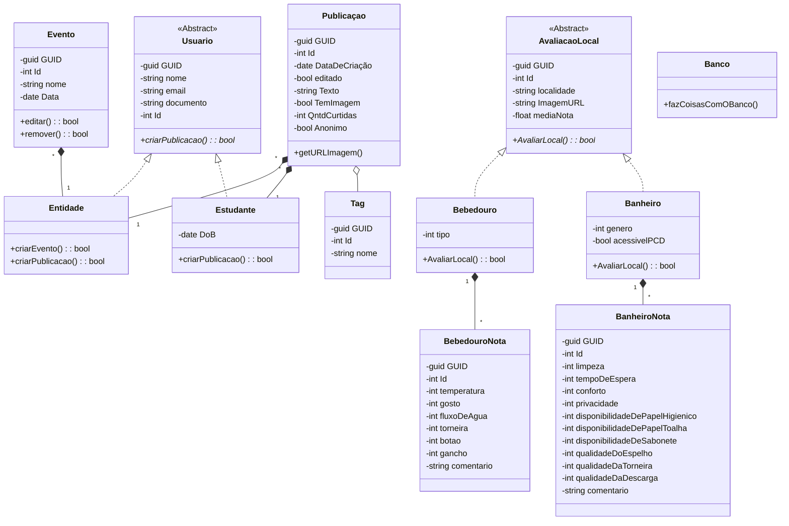

```mermaid

classDiagram

    Publicaçao "*" *-- "1" Entidade
    Publicaçao "*" *-- "1" Estudante
    Usuario <|.. Entidade
    Usuario <|.. Estudante
    Publicaçao o-- Tag
    Evento "*" *-- "1" Entidade
    AvaliacaoLocal <|..  Bebedouro
    AvaliacaoLocal <|.. Banheiro
    Bebedouro "1" *-- "*" BebedouroNota
    Banheiro "1" *-- "*" BanheiroNota

    <<Abstract>> Usuario
    <<Abstract>> AvaliacaoLocal

    class Estudante{
      -date DoB
      +criarPublicacao(): bool
    }

    class Entidade{
      +criarEvento(): bool
      +criarPublicacao(): bool
    }

    class Usuario{
      -guid GUID
      -string nome
      -string email
      -string documento
      -int Id
      +criarPublicacao()*: bool
    }

    class Evento{
      -guid GUID
      -int Id
      -string nome
      -date Data
      +editar(): bool
      +remover(): bool
    }

    class Publicaçao{
      -guid GUID
      -int Id
      -date DataDeCriação
      -bool editado
      -string Texto
      -bool TemImagem
      -int QntdCurtidas
      -bool Anonimo
      +getURLImagem()
    }

    class Banco{
       +fazCoisasComOBanco()
    }

    class Tag{
      -guid GUID
      -int Id
      -string nome
    }

    class AvaliacaoLocal{
      -guid GUID
      -int Id
      -string localidade
      -string ImagemURL
      -float mediaNota
      +AvaliarLocal()*: bool
    }

    class Bebedouro{
      -int tipo
      +AvaliarLocal(): bool
    }

    class Banheiro{
      -int genero
      -bool acessivelPCD
      +AvaliarLocal(): bool
    }

    class BebedouroNota{
      -guid GUID
      -int Id
      -int temperatura
      -int gosto
      -int fluxoDeAgua
      -int torneira
      -int botao
      -int gancho
      -string comentario

    }

    class BanheiroNota{
      -guid GUID
      -int Id
      -int limpeza
      -int tempoDeEspera
      -int conforto
      -int privacidade
      -int disponibilidadeDePapelHigienico
      -int disponibilidadeDePapelToalha
      -int disponibilidadeDeSabonete
      -int qualidadeDoEspelho
      -int qualidadeDaTorneira
      -int qualidadeDaDescarga
      -string comentario
    }

```
