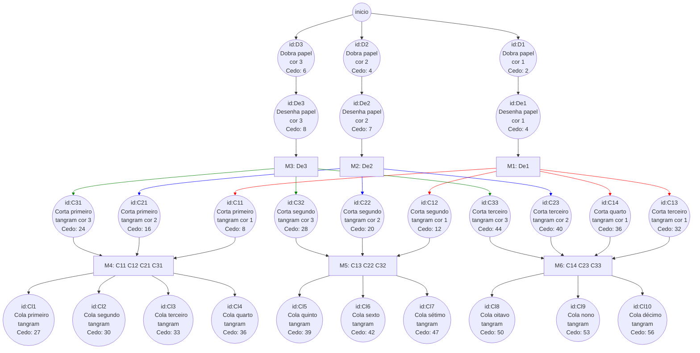

## Pert

```mermaid
flowchart TD
    ini((inicio))
    D1((id:D1\n Dobra papel\n cor 1\n Cedo: 2))
    D2((id:D2\n Dobra papel\n cor 2\n Cedo: 4))
    D3((id:D3\n Dobra papel\n cor 3\n Cedo: 6))

    De1((id:De1\n Desenha papel\n cor 1\n Cedo: 4))
    De2((id:De2\n Desenha papel\n cor 2\n Cedo: 7))
    De3((id:De3\n Desenha papel\n cor 3\n Cedo: 8))

    C11((id:C11\n Corta primeiro\n tangram cor 1\n Cedo: 8))
    C12((id:C12\n Corta segundo\n tangram cor 1\n Cedo: 12))
    C21((id:C21\n Corta primeiro\n tangram cor 2\n Cedo: 16))
    C22((id:C22\n Corta segundo\n tangram cor 2\n Cedo: 20))
    C31((id:C31\n Corta primeiro\n tangram cor 3\n Cedo: 24))
    C32((id:C32\n Corta segundo\n tangram cor 3\n Cedo: 28))
    C13((id:C13\n Corta terceiro\n tangram cor 1\n Cedo: 32))
    C14((id:C14\n Corta quarto\n tangram cor 1\n Cedo: 36))
    C23((id:C23\n Corta terceiro\n tangram cor 2\n Cedo: 40))
    C33((id:C33\n Corta terceiro\n tangram cor 3\n Cedo: 44))

    Cl1((id:Cl1\n 　Cola primeiro　\ntangram\n Cedo: 27))
    Cl2((id:Cl2\n 　Cola segundo　\ntangram\n Cedo: 30))
    Cl3((id:Cl3\n 　Cola terceiro　\ntangram\n Cedo: 33))
    Cl4((id:Cl4\n 　Cola quarto　\ntangram\n Cedo: 36))
    Cl5((id:Cl5\n 　Cola quinto　\ntangram\n Cedo: 39))
    Cl6((id:Cl6\n 　Cola sexto　\ntangram\n Cedo: 42))
    Cl7((id:Cl7\n 　Cola sétimo　\ntangram\n Cedo: 47))
    Cl8((id:Cl8\n 　Cola oitavo　\ntangram\n Cedo: 50))
    Cl9((id:Cl9\n 　Cola nono　\ntangram\n Cedo: 53))
    Cl10((id:Cl10\n 　Cola décimo　\ntangram\n Cedo: 56))

    ini --> D1
    ini --> D2
    ini --> D3

    D1 --> De1
    D2 --> De2
    D3 --> De3

    M1[M1: De1]
    M2[M2: De2]
    M3[M3: De3]

    De1 --> M1
    De2 --> M2
    De3 --> M3

    M1 --> C11
    M1 --> C12
    M1 --> C13
    M1 --> C14

    M2 --> C21
    M2 --> C22
    M2 --> C23

    M3 --> C31
    M3 --> C32
    M3 --> C33

    M4[M4: C11 C12 C21 C31]
    M5[M5: C13 C22 C32]
    M6[M6: C14 C23 C33]

    C11 --> M4
    C21 --> M4
    C31 --> M4

    C12 --> M5
    C22 --> M5
    C32 --> M5

    C13 --> M6
    C14 --> M6
    C23 --> M6
    C33 --> M6

    M4 --> Cl1
    M4 --> Cl2
    M4 --> Cl3
    M4 --> Cl4

    M5 --> Cl5
    M5 --> Cl6
    M5 --> Cl7

    M6 --> Cl8
    M6 --> Cl9
    M6 --> Cl10

    linkStyle 9 stroke:red
    linkStyle 10 stroke:red
    linkStyle 11 stroke:red
    linkStyle 12 stroke:red

    linkStyle 13 stroke:blue
    linkStyle 14 stroke:blue
    linkStyle 15 stroke:blue
    
    linkStyle 16 stroke:green
    linkStyle 17 stroke:green
    linkStyle 18 stroke:green
```

## Gantt

```mermaid
gantt
    title Tangram
    
    dateFormat HH:mm
    axisFormat %H:%M
    
    Start: milestone, start, 00:00, 0
    Sprint1: milestone, sprint1, 00:40, 0
    End: milestone, end, 01:20, 0

    section Aoki
        Dobra papel da cor 1: D1, after start, 2m
        Dobra paple da cor 2: D2, after D1  , 2m
        Dobra paple da cor 3: D3, after D2  , 2m

    section Kaio
        Desenha tangram de cor 1: De1, after D1, 2m
        Desenha tangram de cor 3: De3, after De1 D3, 2m

    section Kikuti
        Desenha tangram de cor 2: De2, after D2, 3m
    
    section Shinji
        Corta primeira parte do papel de cor 1: C11, after De1, 4m
        Corta primeira parte do papel de cor 2: C21, after De2 C11, 4m
        Corta primeira parte do papel de cor 3: C31, after De3 C21, 4m
        Corta segunda parte do papel de cor 1 : C12, after De1 C31, 4m
        Corta segunda parte do papel de cor 2 : C22, after De2 C12, 4m
        Corta segunda parte do papel de cor 3 : C32, after De3 C22, 4m
        Corta terceira parte do papel de cor 1: C13, after De1 C32, 4m
        Corta terceira parte do papel de cor 2: C23, after De2 C13, 4m
        Corta terceira parte do papel de cor 3: C33, after De3 C23, 4m
        Corta quarta parte do papel de cor 1  : C14, after De1 C33, 4m
        
    section Dênis
        Cola primeiro tangram: Co1,  after C31, 3m  
        Cola segundo tangram:  Co2,  after Co1, 3m  
        Cola terceiro tangram: Co3,  after Co2, 3m
        Cola quarto tangram:   Co4,  after Co3 C32, 3m  
        Cola quinto tangram:   Co5,  after Co4,  3m  
        Cola sexto tangram:    Co6,  after Co5, 3m
        Cola setimo tangram:   Co7,  after Co6 C33, 3m  
        Cola oitavo tangram:   Co8,  after Co7, 3m  
        Cola nono tangram:     Co9,  after Co8, 3m  
        Cola decimo tangram:   Co10, after Co9, 3m
```
